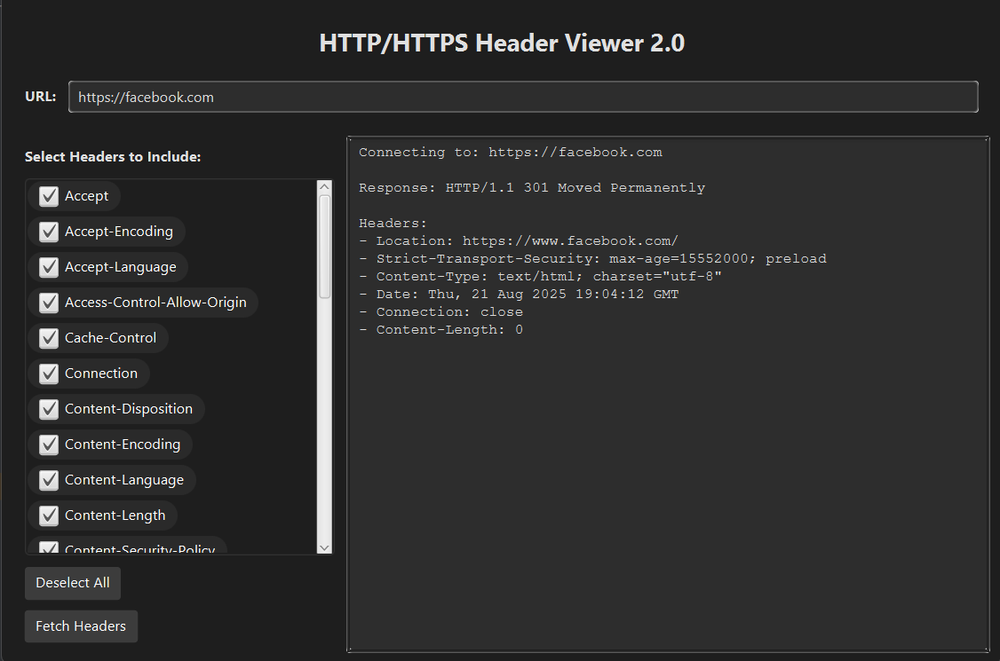

# HTTP/HTTPS Header Viewer 2.0

A simple and interactive JavaFX application that allows users to send HTTP `HEAD` requests to any server and view selected response headers. Built from scratch without using `HttpURLConnection`, this project manually handles HTTP and HTTPS connections using sockets and SSL.

---

---

## Features

-  Supports both HTTP and HTTPS protocols  
-  Lets users select specific headers to view  
-  Checkbox interface with "Select All" and "Deselect All"  
-  Built-in header filtering (only includes selected ones)  
-  Clear and modern JavaFX GUI  
-  Manual socket handling (no `HttpURLConnection` or third-party libraries)

---
##  How to Run

###  Requirements

- Java 17 or newer
- JavaFX SDK
- An IDE (recommend IntelliJ)

---

##  How It Works

- The program parses the URL input by the user
- It decides whether to open a secure `SSLSocket` (for HTTPS) or a normal `Socket` (for HTTP)
- It sends a custom `HEAD` request to the server
- The response is parsed line-by-line, and only headers selected by the user are shown
- Headers are filtered using either exact name matching or regex
